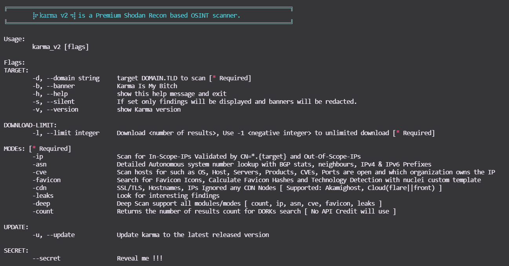

<h1 align="center">
  </a>
  <br>

⡷⠂𝚔𝚊𝚛𝚖𝚊 𝚟𝟸⠐⢾
</h1>

<h2 align="center">
  𝚔𝚊𝚛𝚖𝚊 𝚟𝟸 is a Passive Open Source Intelligence (OSINT) Automated Reconnaissance (framework)
  
  []()  []() []()   [](https://www.paypal.me/dheerajkmadhukar)
</h2>
𝚔𝚊𝚛𝚖𝚊 𝚟𝟸 can be used by Infosec Researchers, Penetration Testers, Bug Hunters to find deep information, more assets, WAF/CDN bypassed IPs, Internal/External Infra, Publicly exposed leaks and many more about their target. Shodan Premium API key is required to use this automation. Output from the 𝚔𝚊𝚛𝚖𝚊 𝚟𝟸 is displayed to the screen and saved to files/directories.
</br></br>
 ℹ  Regarding Premium Shodan API, Please see the Shodan site for more information. 
<br>

Shodan website: [Shodan Website](https://shodan.io)
API : [Developer API](https://developer.shodan.io/api)

## Features
- Powerful and flexible results via Shodan Dorks
- SSL SHA1 checksum/fingerprint Search
- Only hit In-Scope IPs
- Verify each IP with SSL/TLS certificate issuer match RegEx
- Provide Out-Of-Scope IPs
- Find out all ports including well known/uncommon/dynamic
- Grab all targets vulnerabilities related to CVEs
- Banner grab for each IP, Product, OS, Services & Org etc.
- Grab favicon Icons
- Generate Favicon Hash using python3 mmh3 Module
- Favicon Technology Detection using nuclei custom template
- ASN Scan
- BGP Neighbour
- IPv4 & IPv6 Profixes for ASN
- **Interesting Leaks like Indexing, NDMP, SMB, Login, SignUp, OAuth, SSO, Status 401/403/500, VPN, Citrix, Jfrog, Dashboards, OpenFire, Control Panels, Wordpress, Laravel, Jetty, S3 Buckets, Cloudfront, Jenkins, Kubernetes, Node Exports, Grafana, RabbitMQ, Containers, GitLab, MongoDB, Elastic, FTP anonymous, Memcached, DNS Recursion, Kibana, Prometheus, Default Passwords, Protected Objects, Moodle, Spring Boot, Django, Jira, Ruby, Secret Key and many more...**

## Installation
### 1. Clone the repo
 ```bash
# git clone https://github.com/Dheerajmadhukar/karma_v2.git
```
### 2. Install shodan & mmh3 python module
```bash
# python3 -m pip install shodan mmh3
```
### 3. Install JSON Parser [JQ]
```bash
# apt install jq -y
```
### 4. Install httprobe [@tomnomnom](https://github.com/tomnomnom/httprobe) to probe the requests
```bash
# go install -v github.com/tomnomnom/httprobe@master
```
### 5. Install Interlace [@codingo](https://github.com/codingo/Interlace.git) to multithread [Follow the codingo interlace repo instructions]
```bash
# git clone https://github.com/codingo/Interlace.git & install accordingly. 
```
### 6. Install nuclei [@projectdiscovery](https://github.com/projectdiscovery/nuclei)
```bash
# go install -v github.com/projectdiscovery/nuclei/v2/cmd/nuclei@latest
```
### 7. Install lolcat
```bash
# apt install lolcat -y
```
### 8. Install anew
```bash
# go install -v github.com/tomnomnom/anew@master
```

## Ok, how do I use it?
```bash
# cat > .token
SHODAN_PREMIUM_API_HERE
```

## Usage
You can use this command to check help:
```bash
$ bash karma_v2 -h
```


## MODEs 
| **MODE** |  **Examples**  |
|:-------------|:----------------|
|**-ip**|``` bash karma_v2 -d <DOMAIN.TLD> -l <INTEGER> -ip```|
|**-asn**|``` bash karma_v2 -d <DOMAIN.TLD> -l <INTEGER> -asn```|
|**-cve**|``` bash karma_v2 -d <DOMAIN.TLD> -l <INTEGER> -cve```|
|**-cveid**|``` bash karma_v2 -d <DOMAIN.TLD> -l <INTEGER> -cveid CVE-2021-34473```|
|**-favicon**|``` bash karma_v2 -d <DOMAIN.TLD> -l <INTEGER> -favicon```|
|**-leaks**|``` bash karma_v2 -d <DOMAIN.TLD> -l <INTEGER> -leaks```|
|**-deep**|``` bash karma_v2 -d <DOMAIN.TLD> -l <INTEGER> -deep```|
|**-count**|``` bash karma_v2 -d <DOMAIN.TLD> -l <INTEGER> -count```|


## Demo

- karma_v2 [mode -ip]
[](https://asciinema.org/a/1aKFM3oyQZ14t9H8V0qjp2lUV?t=25&speed=5&theme=tango)

---

- karma_v2 [mode -asn]
[](https://asciinema.org/a/0RcsIp6f6xxX81JmEHvvlepBT?t=25&speed=5&theme=tango)

---

- karma_v2 [mode -cve]
[](https://asciinema.org/a/4Ri9FW97qnVV37v3Mb2mNTKz8?t=25&speed=5&theme=tango)

---

- karma_v2 [mode -favicon]
[](https://asciinema.org/a/6bnPXhwacmCOanRRsdNIA1rs4?t=25&speed=5&theme=tango)

---

- karma_v2 [mode -leaks]

[](https://asciinema.org/a/433322?t=25&speed=10&theme=tango)

---

- karma_v2 [mode -deep]

**`-deep` support all the above modes e.g. -count,-ip,-asn,-favicon,-cve,-leaks !**

---

# Output
```bash
output/bugcrowd.com-YYYY-MM-DD/ 

.
├── ASNs_Detailed_bugcrowd.com.txt
├── Collect
│   ├── host_domain_domain.tld.json.gz
│   ├── ssl_SHA1_12289a814...83029f8944b6088d60204a92e_domain.tld.json.gz
│   ├── ssl_SHA1_17537bf84...73cb1d684a495db7ea5aa611b_domain.tld.json.gz
│   ├── ssl_SHA1_198d6d4ec...681b77585190078b07b37c5e1_domain.tld.json.gz
│   ├── ssl_SHA1_26a9c5618...d60eae2947b42263e154d203f_domain.tld.json.gz
│   ├── ssl_SHA1_3da3825a2...3b852a42470410183adc3b9ee_domain.tld.json.gz
│   ├── ssl_SHA1_4d0eab730...68cf11d2db94cc2454c906532_domain.tld.json.gz
│   ├── ssl_SHA1_8907dab4c...12fdbdd6c445a4a8152f6b7b7_domain.tld.json.gz
│   ├── ssl_SHA1_9a9b99eba...5dc5106cea745a591bf96b044_domain.tld.json.gz
│   ├── ssl_SHA1_a7c14d201...b6fd4bc4e95ab2897e6a0bsfd_domain.tld.json.gz
│   ├── ssl_SHA1_a90f4ddb0...85780bdb06de83fefdc8a612d_domain.tld.json.gz
│   ├── ssl_domain_domain.tld.json.gz
│   ├── ssl_subjectCN_domain.tld.json.gz
│   └── ssl_subject_domain.tld.json.gz
|   └── . . .
├── IP_VULNS
│   ├── 104.x.x.x.json.gz
│   ├── 107.x.x.x.json.gz
│   ├── 107.x.x.x.json.gz
│   └── 99.x.x.x.json.gz
|   └── . . .
├── favicons_domain.tld.txt
├── host_enum_domain.tld.txt
├── ips_inscope_domain.tld.txt
├── main_domain.tld.data
├── . . . 
```


## karma_v2 Newly Added Shodan Dorks

- SonarQube
- Apache hadoop node
- Directory Listing
- Oracle Business intelligence
- Oracle Web Login
- Docker Exec
- Apache Status
- Apache-Coyote/1.1 Tomcat-5.5
- Swagger UI
- H-SPHERE
- Splunk
- JBoss
- phpinfo
- ID_VC
- Confluence
- TIBCO_Jaspersoft
- Shipyard_Docker_management
- Symfony PHP info AWS creds
- Ignored-by_CDNs
- Django_Exposed
- Cluster_Node_etcd
- SAP_NetWeaver_Application
					
# 𝚔𝚊𝚛𝚖𝚊 𝚟𝟸 Supported Shodan Dorks
| **DORKs** | **DORKs** | **DORKs** |
|:-------------|:----------------|:----------------|
| **`ssl.cert.fingerprint`**  |    **`http.status:"302" oauth`**    | **`"Server: Jetty"`**           |
| **`ssl`** |   **`http.status:"302" sso`**    | **`X-Amz-Bucket-Region`**           |
| **`org`** |    **`title:"401 Authorization Required"`**    | **`"development" org:"Amazon.com"`**           |
| **`hostname`**  |    **`http.html:"403 Forbidden"`**    | **`"X-Jenkins" "Set-Cookie: JSESSIONID" http.title:"Jenkins [Jenkins]"`**           |
| **`ssl.cert.issuer.cn`**      |    **`http.html:"500 Internal Server Error"`**    | **`http.favicon.hash:81586312 200`**           |
| **`ssl.cert.subject.cn`** |    **`ssl.cert.subject.cn:*vpn*`**    | **`product:"Kubernetes" port:"10250, 2379"`**            |
| **`ssl.cert.expired:true`** |    **`title:"citrix gateway"`**    | **`port:"9100" http.title:"Node Exporter"`**           |
| **`ssl.cert.subject.commonName`** |    **`http.html:"JFrog"`**    | **`http.title:"Grafana"`**           |
| **`http.title:"Index of /"`** |    **`"X-Jfrog"`**    | **`http.title:"RabbitMQ"`**           |
| **`ftp port:"10000"`** |    **`http.title:"dashboard"`**    | **`HTTP/1.1 307 Temporary Redirect "Location: /containers"`**            |
| **`"Authentication: disabled" port:445 product:"Samba"`** |    **`http.title:"Openfire Admin Console"`**    | **`http.favicon.hash:1278323681`**            |
| **`title:"Login - Adminer"`** |    **`http.title:"control panel"`**    | **`"MongoDB Server Information" port:27017 -authentication`**            |
| **`http.title:"sign up"`** |    **`http.html:"* The wp-config.php creation script uses this file"`**    | **`port:"9200" all:"elastic indices" `**            |
| **`http.title:"LogIn"`** |   **`clockwork`**    | **`"220" "230 Login successful." port:21`**            |
| **`port:"11211" product:"Memcached"`** | **`"port: 53" Recursion: Enabled`** | **`title:"kibana"`** |
| **`port:9090 http.title:"Prometheus Time Series Collection and Processing Server"`** | **`"default password"`** | **`title:protected`** |
| **`http.component:Moodle`** | **`http.favicon.hash:116323821`** | **`html:"/login/?next=" title:"Django"`** |
| **`html:"/admin/login/?next=" title:"Django"`** | **`title:"system dashboard" html:jira`** | **`http.component:ruby port:3000`** |
| **`html:"secret_key_base"`** | **`I will add more soon`** | **`. . .`** |


# 𝚔𝚊𝚛𝚖𝚊 𝚟𝟸 Newly Added Shodan Dorks
| **DORKs** | **DORKs** | **DORKs** |
|:-------------|:----------------|:----------------|
| **`"netweaver"`**  |    **`port:"2379" product:"etcd"`**    | **`http.title:"DisallowedHost"`**           |
| **`ssl:"${target}" "-AkamaiGHost" "-GHost"`**  |    **`ssl:"${target}" "-Cloudflare"`**    | **`ssl:"${target}" "-Cloudfront"`**           |
| **`"X-Debug-Token-Link" port:443`**  |    **`http.title:"shipyard" HTTP/1.1 200 OK Accept-Ranges: bytes Content-Length: 5664`**    | **`http.title:"TIBCO Jaspersoft:" port:"443" "1970"`**           |
| **`"Confluence"`**  |    **`http.title:"SonarQube"`**    | **`html:"jmx?qry=Hadoop:*"`**           |
| **`http.title:"Directory Listing"`**  |    **`http.title:"H-SPHERE"`**    | **`http.title:"Swagger UI - "`**           |
| **`Server: Apache-Coyote/1.1 Tomcat-5.5"`**  |    **`port:2375 product:"Docker"`**    | **`http.title:"phpinfo()"`**           |
| **`http.title:"ID_VC_Welcome"`**  |    **`"x-powered-by" "jboss"`**    | **`jboss http.favicon.hash:-656811182`**           |
| **`http.title:"Welcome to JBoss"`**  |    **`port:"8089, 8000" "splunkd"`**    | **`http.favicon.hash:-316785925`**           |
| **`title:"splunkd" org:"Amazon.com"`**  |    **`http.title:"oracle business intelligence sign in"`**    | **`http.title:"Oracle WebLogic Server Administration Console"`**           |
| **`http.title:"Apache Status"`**  |    **`I will add more soon`**    | **`. . .`**           |


## Support
If you like `⡷⠂𝚔𝚊𝚛𝚖𝚊 𝚟𝟸⠐⢾` and it help you in work, money/bounty, pentesting, recon or just brings you happy feelings, please show your support ! 
:stop_sign:   **Please avoid opening GitHub issues for support requests or questions!**
buy me a beer to keep me powered :)

<a href="https://www.buymeacoffee.com/medheeraj" target="_blank"></a>
